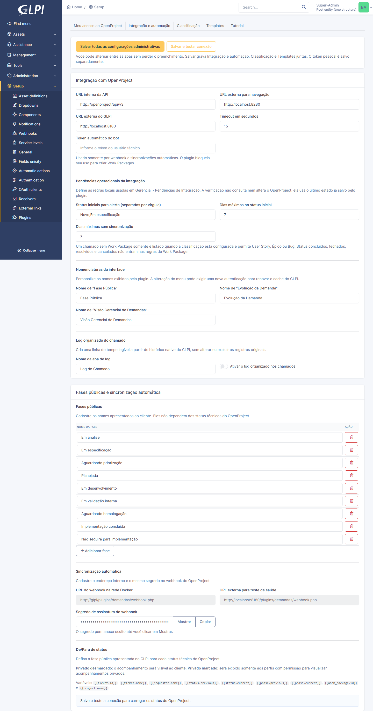
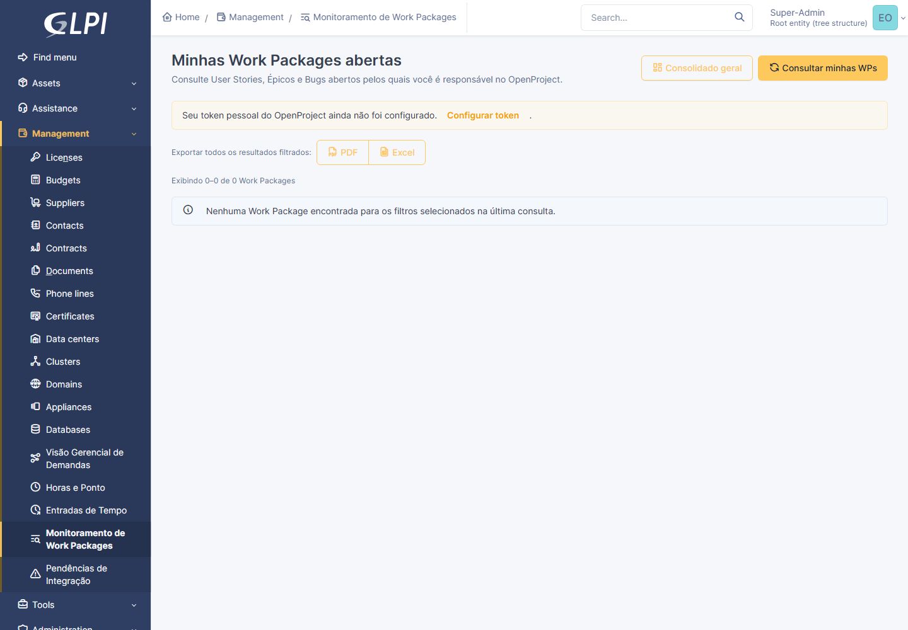
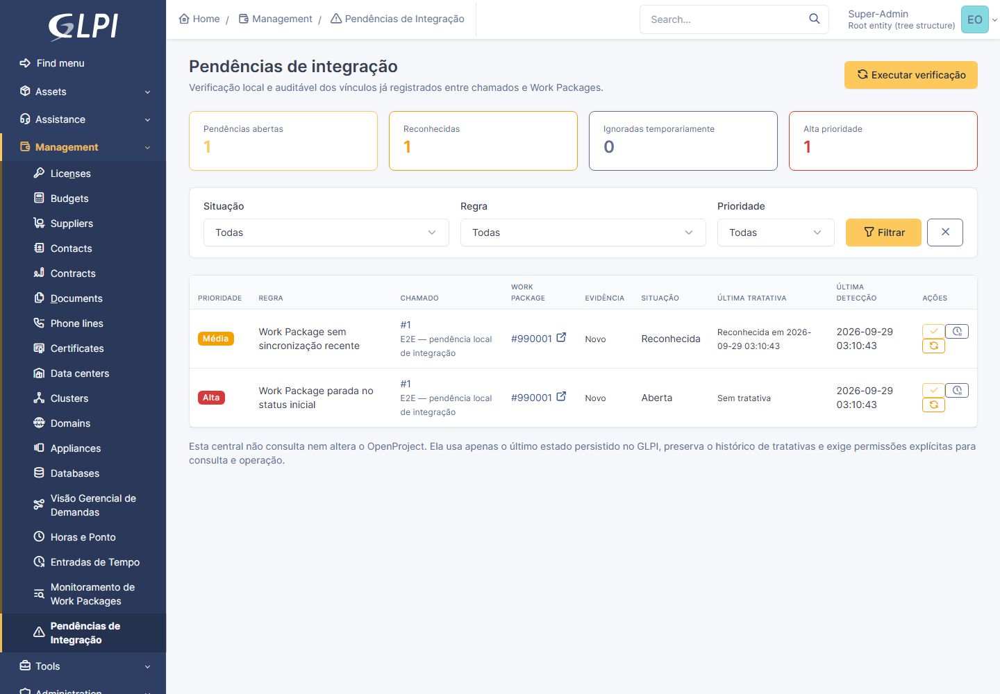

# Manual do Plugin Gestão de Demandas

> Versão de referência: **0.22.0** · Compatível com GLPI 11 e OpenProject 17.x.

## 1. Finalidade

O plugin conecta o ciclo de atendimento do GLPI à gestão técnica realizada no OpenProject. O chamado permanece como a referência de atendimento; a Work Package (WP) concentra a execução técnica. O plugin também disponibiliza recursos independentes de ponto, banco de horas e lançamentos de tempo em WPs.

Use este manual para configurar os perfis, operar os fluxos e validar o comportamento esperado. Informações técnicas de continuidade estão em [CODEX_HANDOFF.md](CODEX_HANDOFF.md).

## 2. Princípios de acesso e segurança

As permissões em **Administração > Perfis > Gestão de Demandas** são a única fonte de autorização do plugin. O nome do perfil — inclusive *Super-Admin*, *Master* ou *Cliente* — não concede funções automaticamente.

| Permissão | Permite |
|---|---|
| Visualizar a evolução pública da demanda | Consultar somente a fase pública e acompanhamentos públicos autorizados. |
| Visualizar dados técnicos do OpenProject | Ver IDs, links, status e demais dados técnicos de WPs. |
| Visualizar o histórico da integração | Consultar o histórico técnico de sincronizações. |
| Criar e vincular Work Packages | Criar WPs a partir de chamados autorizados. |
| Executar sincronização manual | Atualizar manualmente WPs já vinculadas. |
| Administrar as configurações do plugin | Alterar URLs, token do bot, mapeamentos, templates e regras administrativas. |
| Acessar / Exportar a visão gerencial | Consultar ou exportar a Visão Gerencial de Demandas. |
| Preparar contexto de chamado e WP para IA externa | Preparar um texto local para cópia consciente em uma IA externa. |
| Visualizar pendências operacionais da integração | Consultar a Central de Pendências de Integração. |
| Executar e tratar pendências operacionais da integração | Executar a verificação e reconhecer, ignorar temporariamente ou reabrir pendências. |

As permissões de monitoramento, alertas, IA e pendências exigem também **Visualizar dados técnicos do OpenProject**. O plugin repete as verificações no servidor; ocultar um menu não permite acesso direto por URL.

## 3. Instalação e atualização

1. Faça backup do banco e da pasta atual do plugin.
2. Copie a pasta `demandas` para `plugins/demandas` do GLPI.
3. No GLPI, acesse **Configuração > Plugins**.
4. Na primeira utilização, clique em **Instalar** e depois em **Ativar**.
5. Para atualizar, clique somente em **Atualizar**. **Não desinstale** o plugin: a desinstalação remove seus vínculos, configurações e históricos.
6. Após a atualização, revise os novos direitos em **Administração > Perfis > Gestão de Demandas**.

## 4. Configuração administrativa inicial

Esta etapa exige **Administrar as configurações do plugin**. Acesse a configuração do plugin e use a aba **Integração e automação**.

1. Informe a **URL interna da API do OpenProject**. Em Docker, ela normalmente termina em `/api/v3` e usa o hostname interno.
2. Informe a **URL externa para navegação** do OpenProject. Ela é usada nos links abertos pelo navegador.
3. Informe a **URL externa do GLPI**.
4. Defina o timeout de comunicação.
5. Informe o **token automático do bot**. Ele é exclusivo de webhook e sincronizações automáticas; não é usado para criar WPs.
6. Clique em **Salvar e testar conexão**.

Nunca registre token, senha ou URL privada em anexos, acompanhamentos ou repositórios. O token automático deve pertencer a um usuário técnico com o menor conjunto possível de permissões no OpenProject.

### 4.1 Fases, status e webhook

- Cadastre as fases públicas apresentadas ao solicitante.
- Em **De/Para de status**, associe cada status técnico do OpenProject a uma fase pública, mensagem padrão, envio automático e visibilidade do acompanhamento.
- Cadastre no OpenProject o webhook de **Work package atualizada**, usando a URL e o segredo apresentados pelo plugin. Restrinja o evento aos projetos necessários.
- Mantenha o segredo do webhook privado.

### 4.2 Classificação e templates

Na aba **Classificação**, determine de onde vem a classificação do chamado e os tipos de WP permitidos para cada valor. Uma classificação configurada sem regra correspondente bloqueia a criação de WP por segurança.

Na aba **Templates**, preencha o Markdown exigido para cada tipo de WP. O plugin bloqueia a criação se o tipo selecionado não possuir template configurado.

## 5. Token pessoal do OpenProject

Cada pessoa que cria WPs, sincroniza manualmente, monitora WPs ou lança tempo deve configurar o próprio token:

1. Abra **Minhas configurações > Meu acesso ao OpenProject**.
2. Informe o token pessoal da API.
3. Clique em **Salvar meu token** ou **Salvar e testar**.

O valor não é mostrado novamente. Deixá-lo vazio em uma edição mantém o token atual. O token pessoal não dá direito a uma função no GLPI: as permissões do perfil continuam obrigatórias.

## 6. Fluxo do chamado e Work Package

### 6.1 Criar uma WP

1. Abra o chamado e confirme que o perfil possui **Criar e vincular Work Packages**.
2. Na área técnica da demanda, escolha o projeto e o tipo de WP permitido.
3. Preencha os campos solicitados pelo OpenProject.
4. Confirme a criação.

O plugin registra o vínculo, a fase pública e o histórico técnico. Um chamado pode possuir mais de uma WP. Ao criar uma WP adicional, informe o motivo solicitado pelo formulário.

### 6.2 Consultar e sincronizar

- Use **Sincronizar** no chamado quando possuir **Executar sincronização manual**.
- A sincronização atualiza os dados técnicos locais e pode atualizar a fase pública conforme o de/para configurado.
- O histórico técnico é visível somente a perfis autorizados.
- Clientes com somente visão pública não devem ver ID, link, status técnico ou responsáveis da WP.

## 7. Monitoramento de Work Packages

Em **Gerência > Monitoramento de Work Packages > Minhas Work Packages**, o usuário autorizado pode consultar User Stories, Épicos e Bugs abertos dos quais é responsável no OpenProject.

1. Configure o token pessoal.
2. Clique em **Consultar minhas WPs** e aguarde o indicador de carregamento.
3. Use os cards de status para filtrar por situação.
4. Use os filtros por status, chamado GLPI, cliente do OpenProject e responsável.
5. Escolha 25, 50, 100 ou 200 itens por página conforme necessário.

Os links da WP e do chamado abrem em nova aba. A consulta é somente leitura e não cria nem altera WPs.

### 7.1 Alertas e consolidado

O sino no cabeçalho apresenta alertas pessoais gerados pelas consultas. A prévia é compacta; o histórico completo fica em **Gerência > Monitoramento de Work Packages > Alertas de Work Packages**.

O botão **Consolidado geral** aparece para quem também possui **Acessar a visão gerencial**. Ele reúne os snapshots das consultas realizadas por todos os usuários; não faz nova consulta ao OpenProject.

## 8. Preparar análise em IA externa

Na listagem pessoal de WPs, use **Preparar IA** quando possuir a permissão específica. O recurso permite selecionar quais dados serão incluídos no texto: WP, chamado, status, responsável, cliente, links, resumo, descrição, acompanhamentos públicos e anexos escolhidos.

O texto e a extração de anexos ocorrem localmente. PDF, documentos e imagens podem ter conteúdo extraído/OCR antes da cópia. Nada é enviado automaticamente a uma IA. Antes de colar o contexto no ChatGPT ou em outra ferramenta, confirme que você tem autorização para compartilhar todo o conteúdo selecionado, especialmente anexos e imagens.

## 9. Central de Pendências de Integração

Em **Gerência > Pendências de Integração**, o plugin confere dados locais já sincronizados. Para abrir a página, o perfil precisa de **Visualizar dados técnicos do OpenProject** e **Visualizar pendências operacionais da integração**.

### 9.1 Configurar regras

Em **Configuração do plugin > Integração e automação**, defina:

- os status iniciais separados por vírgula, por exemplo `Novo,Em especificação`;
- quantos dias uma WP pode permanecer em status inicial;
- quantos dias uma WP pode permanecer sem sincronização.

### 9.2 Executar e interpretar

O botão **Executar verificação** requer também a permissão **Executar e tratar pendências operacionais da integração**. A execução não chama e não altera o OpenProject.

As regras atuais são:

| Regra | Significado |
|---|---|
| Chamado elegível sem Work Package | Chamado GLPI aberto cuja classificação permite User Story, Épico ou Bug, mas não possui vínculo local. |
| Work Package parada no status inicial | WP ainda em um status inicial configurado acima do prazo. |
| Work Package sem sincronização recente | WP sem confirmação de sincronização dentro do prazo. |

Use os cards e filtros para priorizar a lista. Em cada ocorrência, é possível:

- **Reconhecer:** registra que alguém assumiu a conferência;
- **Ignorar por sete dias:** silencia temporariamente uma pendência conhecida;
- **Reabrir:** devolve a ocorrência à fila aberta.

Cada ação é auditada. A ocorrência é resolvida automaticamente na próxima verificação se a condição deixar de existir. A central não cria vínculo, não atualiza status e não envia acompanhamentos; a correção deve ser feita pelo usuário autorizado no GLPI ou OpenProject.

### 9.3 Captura validada pela suíte prática

A captura abaixo é atualizada somente pelo Playwright em uma base isolada com dados fictícios. Ela nunca deve ser gerada a partir de produção ou de uma cópia de produção.

Veja [tests/e2e/README.md](../tests/e2e/README.md) para preparar o ambiente e gerar novamente a imagem antes de uma nova release.

## 10. Visão Gerencial de Demandas

Acesse **Gerência > Visão Gerencial de Demandas** com a permissão própria. O painel apresenta cobertura de WPs, demandas sem documentação, envelhecimento, sincronização e distribuições por classificação, cliente, status, fase, projeto e tipo.

- O painel de filtros é recolhido por padrão; expanda-o para combinar os critérios.
- Os indicadores levam ao detalhamento correspondente.
- Clique nos títulos das colunas para ordenar a grade mantendo os filtros aplicados.
- PDF e Excel exigem a permissão de exportação e preservam os filtros e a ordenação atual.

## 11. Horas, ponto e ausências

Os recursos de ponto são independentes das entradas de tempo enviadas ao OpenProject.

### 11.1 Registro de ponto

Em **Gerência > Horas e Ponto**, registre as marcações do dia. O calendário considera a semana de domingo a sábado, identifica intervalo de almoço e destaca o dia atual. Dias sem marcação e sem ausência são neutros: não geram débito no banco de horas.

Use o modal do dia para lançar múltiplas marcações. Os tipos são sugeridos na ordem: Entrada manhã, Saída manhã, Entrada tarde e Saída tarde.

### 11.2 Ausências e banco de horas

- Registre ausência integral ou parcial, justificada ou não.
- Ausência justificada é neutra no banco de horas e pode conter comprovantes.
- Ausência não justificada gera o débito correspondente.
- Em **Minhas ausências**, consulte e filtre seus registros; anexos autorizados podem ser baixados.
- Em **Auditoria do Banco de Horas**, confira saldo histórico, créditos, débitos e faltas justificadas neutras.
- O saldo histórico é opcional e deve reproduzir o valor de outro sistema na data-base informada.

### 11.3 Feriados e dias não úteis

Perfis com **Administrar feriados e compensações** configuram os dias sem expediente. Feriados, compensações e dias não úteis cadastrados não incidem no banco de horas.

## 12. Entradas de tempo em Work Packages

Em **Gerência > Entradas de Tempo**, lance horas efetivamente dedicadas a WPs vinculadas. Selecione chamado/WP, data, atividade, início, fim e comentário quando aplicável. Essas entradas são independentes do ponto.

Somente entradas de tempo são sincronizadas com o OpenProject. Marcações de ponto nunca são enviadas como tempo de WP.

## 13. Checklist de operação

- configuração automática testada e webhook assinado;
- mapeamento de status e mensagens públicas revisados;
- classificação e templates preenchidos;
- tokens pessoais registrados somente pelos operadores necessários;
- perfis de cliente limitados à visão pública;
- permissões técnicas, de monitoramento, IA e pendências concedidas somente a perfis internos responsáveis;
- prazos da Central de Pendências revisados;
- feriados e dias não úteis configurados antes da conferência do banco de horas.

## 14. Solução de problemas

| Sintoma | Verificação inicial |
|---|---|
| Menu ou botão não aparece | Confira o perfil ativo e cada permissão exigida; saia e entre novamente se o GLPI mantiver o menu em cache. |
| Consulta de WPs não retorna dados | Confirme o token pessoal, as permissões no OpenProject e se o usuário é responsável pelas WPs abertas. |
| Erro ao sincronizar | Confirme o token pessoal, URL interna, acesso da WP e histórico técnico do chamado. |
| Cliente vê dados de WP | Revogue imediatamente **Visualizar dados técnicos do OpenProject** e revise o perfil ativo; visão pública não deve conceder esse direito. |
| Pendência não aparece | Execute uma nova verificação, confira entidades ativas, leitura do chamado, classificação e prazos configurados. |
| Pendência não desaparece | Corrija a condição no sistema de origem e execute a verificação novamente. |

Não registre senhas, tokens, conteúdo integral de chamados ou anexos sensíveis em solicitações de suporte. Para dados técnicos e histórico de versões, consulte a documentação de release em `docs/`.
